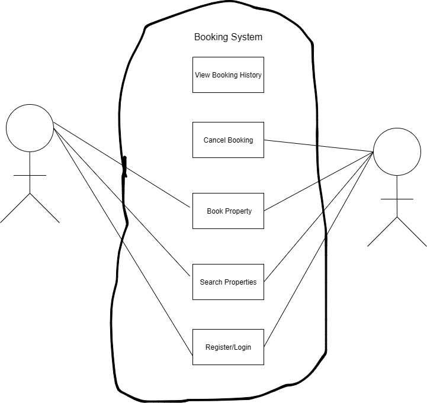

# Requirement Analysis in Software Development

## Introduction

This repository is created to demonstrate the concept and practice of requirement analysis in the software development lifecycle (SDLC). 

Requirement analysis is a crucial phase that involves gathering, analyzing, and documenting stakeholders' needs to ensure the successful delivery of software solutions. 

It helps in defining project scope, preventing scope creep, and guiding the development team through well-defined functional and non-functional requirements.

## What is Requirement Analysis?

Requirement Analysis is a fundamental phase in the Software Development Life Cycle (SDLC) that involves identifying, gathering, analyzing, and documenting the needs and expectations of stakeholders for a software system.

The goal of requirement analysis is to clearly define what the software system should do and how it should behave. This includes both **functional requirements** (features, behaviors, and interactions) and **non-functional requirements** (performance, security, usability, reliability, etc.).

### Importance of Requirement Analysis in SDLC:

- ✅ **Defines project scope**: Establishes clear boundaries and expectations for the software project.
- ✅ **Minimizes misunderstandings**: Helps prevent miscommunication between stakeholders and the development team.
- ✅ **Reduces rework**: Clearly documented and validated requirements reduce the chances of costly changes during development.
- ✅ **Improves planning**: Enables accurate estimation of time, cost, and resources.
- ✅ **Ensures stakeholder satisfaction**: Results in a final product that meets or exceeds user expectations.

Requirement Analysis acts as the foundation for design, development, and testing phases, ensuring that the software solution aligns with business goals and user needs.

## Why is Requirement Analysis Important?

Requirement Analysis plays a crucial role in the success of any software development project. It ensures that the final product meets the expectations of stakeholders and functions as intended. Below are three key reasons why Requirement Analysis is important in the SDLC:

### 1. Prevents Scope Creep
By clearly defining and documenting requirements early in the project, requirement analysis helps avoid unplanned features and changes that can lead to scope creep, increased costs, and missed deadlines.

### 2. Improves Communication and Understanding
Requirement analysis acts as a communication bridge between stakeholders and developers. It ensures that both technical and non-technical stakeholders have a shared understanding of the system’s objectives and functionalities.

### 3. Enhances Project Planning and Resource Allocation
With well-defined requirements, project managers can estimate timeframes, allocate resources more efficiently, and identify potential risks early. This leads to better planning, scheduling, and budgeting throughout the project lifecycle.

Additional benefits include improved software quality, reduced development effort, and increased stakeholder satisfaction.

## Key Activities in Requirement Analysis

Requirement Analysis involves several essential activities to ensure the software meets user needs and expectations. Below are the five key activities:

- **Requirement Gathering**
  - Involves collecting raw information and expectations from stakeholders.
  - Uses methods like surveys, interviews, observations, and document reviews.
  - Forms the foundation for further refinement.

- **Requirement Elicitation**
  - Focuses on understanding and clarifying stakeholder needs.
  - Engages stakeholders through brainstorming, focus groups, and prototyping.
  - Aims to uncover hidden or implicit requirements.

- **Requirement Documentation**
  - Translates gathered and elicited requirements into structured formats.
  - Includes use cases, user stories, functional specifications, and requirement specification documents (SRS).
  - Ensures requirements are clearly written and traceable.

- **Requirement Analysis and Modeling**
  - Involves analyzing requirements for completeness, feasibility, and consistency.
  - Uses models like use case diagrams, data flow diagrams (DFD), and entity-relationship diagrams (ERD).
  - Helps in visualizing and organizing complex requirements.

- **Requirement Validation**
  - Ensures that the documented requirements accurately reflect stakeholder needs.
  - Conducts reviews, inspections, and walkthroughs with stakeholders.
  - Helps identify and correct errors early in the development process.
## Types of Requirements

Requirements in software development are broadly categorized into two types: **Functional Requirements** and **Non-functional Requirements**. Both are essential to building a complete and reliable system.

### Functional Requirements

Functional requirements define what the system should do. These are the specific features and behaviors that allow users to interact with the system and perform desired tasks.

**Examples for a Booking Management Project:**
- Users can search for available properties by location, date, and price range.
- Users can register and log in securely.
- Users can book a selected property and receive a confirmation email.
- Admins can add, edit, or remove property listings.
- The system should calculate and display total booking cost, including taxes and discounts.

### Non-functional Requirements

Non-functional requirements define how the system should perform. These requirements ensure the system is usable, secure, and reliable under various conditions.

**Examples for a Booking Management Project:**
- The system must load search results in under 2 seconds.
- User data must be encrypted and stored securely.
- The system should be available 99.9% of the time (high availability).
- The user interface should be mobile-friendly and responsive.
- The platform should support up to 10,000 concurrent users without performance degradation.

## Use Case Diagrams

Use Case Diagrams are a type of Unified Modeling Language (UML) diagram used in requirement analysis to visualize the interactions between users (actors) and the system. They help stakeholders understand system functionality at a high level by identifying **who** uses the system and **what** operations they perform.

### ✅ Benefits of Use Case Diagrams:
- Clarify system scope and functionality
- Help identify user roles and interactions
- Serve as a foundation for writing functional requirements
- Facilitate communication between stakeholders and developers

### 📌 Use Case Diagram for Booking System

The diagram below illustrates the main actors and use cases in a property booking system:

